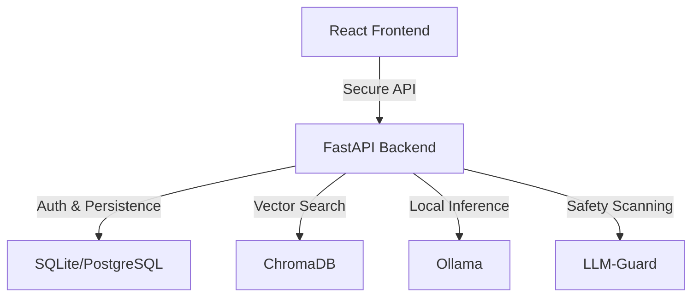

<p align="center">
  
</p>

<h1 align="center">Drifting-Apollo</h1>
<p align="center"><b>Secure Local AI Workspace (SLAW)</b><br>
An enterprise-ready, private workspace for local-first AI workflows, document intelligence, and secure collaboration.</p>

<p align="center">
  <a href="https://opensource.org/licenses/MIT">
    
  </a>
  
  
  
  
</p>

---

## 🚀 Overview

**Drifting-Apollo** is a self-hosted AI workspace designed for teams requiring high-security, local-first environments. It integrates advanced LLM capabilities with document retrieval (RAG) and rigorous security screening to provide a robust alternative to cloud-based AI services.

## ✨ Core Capabilities

- **🔐 Enterprise-Grade Security**: Integrated LLM-Guard for prompt injection protection, PII filtering (optional), and sensitive content scanning.
- **📄 Document Intelligence**: High-performance RAG (Retrieval-Augmented Generation) supporting PDF and text formats with vector storage via Chroma.
- **👥 Multi-Tenant Architecture**: Robust role-based access control (RBAC) with `Admin` and `User` levels.
- **💬 Session Persistence**: Individualized chat history and secure state management per authenticated user.
- **🛠️ Self-Healing Diagnostics**: Real-time service status monitoring for backend components (Ollama, Chroma, Database).

## 🛡️ Security & Privacy

Architecture is built with a **Security-First** mindset:
- **Local-Only Access**: Services are bound to `127.0.0.1` by default, preventing unauthorized external exposure.
- **Automated Sanitization**: Optional safety scanning for both user prompts and model outputs.
- **Secure Authentication**: Rate-limited sign-in and automated secret generation for session security.
- **Resource Constraints**: Strict limits on file sizes and API request complexity to ensure system stability.

## 🏗️ Technical Architecture



## 🛠️ Infrastructure

The project utilizes a modern containerized stack:
- **Frontend**: React, Vite, Tailwind CSS
- **Backend API**: FastAPI (Python 3.10+)
- **Vector Database**: ChromaDB
- **Inference Engine**: Ollama
- **Safety Proxy**: LLM-Guard Sidecar

## 🚦 Quick Start

### 1. Provision Services
Use Docker Compose to spin up the auxiliary services:
```bash
docker compose up -d
```
*To enable security scanning, use the security profile:*
```bash
docker compose --profile security up -d
```

### 2. Configure Backend
```bash
cd backend
python -m venv .venv && source .venv/bin/activate
pip install -r requirements.txt
python main.py
```

### 3. Launch Frontend
```bash
cd frontend
npm install && npm run dev
```
Navigate to `http://localhost:5173` to initialize the first administrator account.

## 📝 Configuration

Configuration is managed via environment variables. Refer to [llm-guard/scanners.yml](llm-guard/scanners.yml) for security tuning parameters.

## 🛣️ Roadmap
- [ ] Granular Department-wide Access Rules
- [ ] Semantic History Search & Named Threads
- [ ] Advanced Workspace Data Partitioning
- [ ] Production-hardened LLM-Guard Tuning

## ⚖️ License
This project is licensed under the [MIT License](LICENSE).
