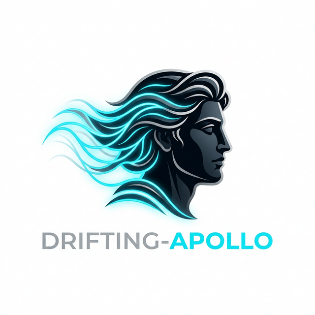
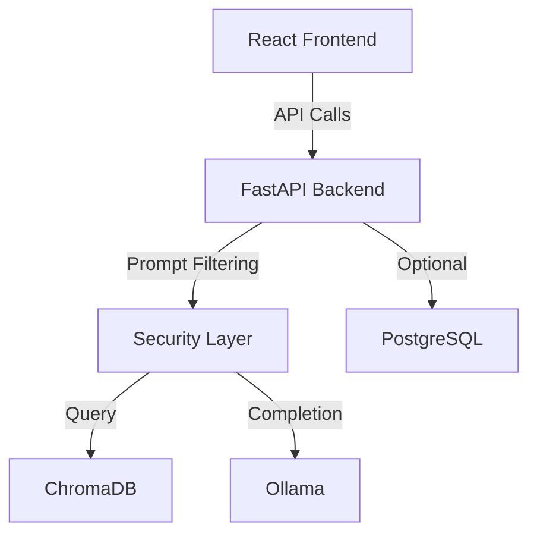

<p align="center">
  
</p>

# Drifting-Apollo: Secure Local AI Workspace (SLAW) 🛡️🤖

[](https://opensource.org/licenses/MIT)
[](https://skillicons.dev)

A local-first, privacy-conscious AI workspace designed for developers and researchers. **SLAW** provides a secure environment for document intelligence, local LLM interaction, and robust data privacy by keeping your AI stack entirely local.

## 🚀 Unified Infrastructure

The workspace is now fully containerized using Docker, providing a consistent environment for all core services:

- **Frontend**:   Vite + React
- **Backend API**:   FastAPI (Python)
- **Vector Intelligence**:  ChromaDB (Containerized)
- **Model Engine**:  Ollama (Containerized or Local)
- **Database**:  PostgreSQL 15

## 🛡️ Security & Hardening

Security is a core pillar of **Drifting-Apollo**. Recent updates include:

- **Hardened CORS Policy**: Strict origin validation restricted to authorized local development environments (`http://localhost:5173`).
- **Resource Constraints**: 
  - **File Size Limits**: Document uploads are capped at **10MB** to prevent resource exhaustion.
  - **Input Sanitization**: Basic prompt injection filtering for incoming queries.
- **Supply Chain Security**: All backend dependencies are **pinned** to specific, verified versions in `requirements.txt`.
- **Privacy First**: No telemetry or external API calls are made for inference or vector storage when configured with local models.

## ✨ Core Features

- **Document Intelligence (RAG)**: Index PDF and TXT files (up to 10MB) for context-aware chat.
- **Enhanced Health Monitoring**: The UI provides real-time status for the API, LLM engine, and Vector database.
- **Security Layer**: 
  - Prompt injection detection.
  - Malicious query logging.
- **Workspace Views**: Preview roles for User and Admin views (RBAC logic pending).

## 🏗️ Architecture



## 🛠️ How to Run

### 1. Prerequisites
- [Docker & Docker Compose](https://docs.docker.com/get-docker/)
- [Node.js](https://nodejs.org/) (for frontend development)
- [Python 3.10+](https://www.python.org/)

### 2. Start Infrastructure
Launch all core services (PostgreSQL, ChromaDB, Ollama) using our unified compose file:

```bash
docker-compose up -d
```

### 3. Setup Backend
1. `cd backend`
2. `python -m venv venv && source venv/bin/activate` # Recommended
3. `pip install -r requirements.txt`
4. `python main.py`

### 4. Setup Frontend
1. `cd frontend`
2. `npm install`
3. `npm run dev`

Access the UI at: `http://localhost:5173`

## 🚧 Roadmap & Gaps
- [ ] **RBAC & JWT**: Full authentication and Role-Based Access Control.
- [ ] **Persistence Layer**: Wiring PostgreSQL for user and chat history storage.
- [ ] **Advanced Filtering**: Integration with LLM-Guard for production-grade security.

## 📄 License
This project is licensed under the MIT License - see the [LICENSE](LICENSE) file for details.
