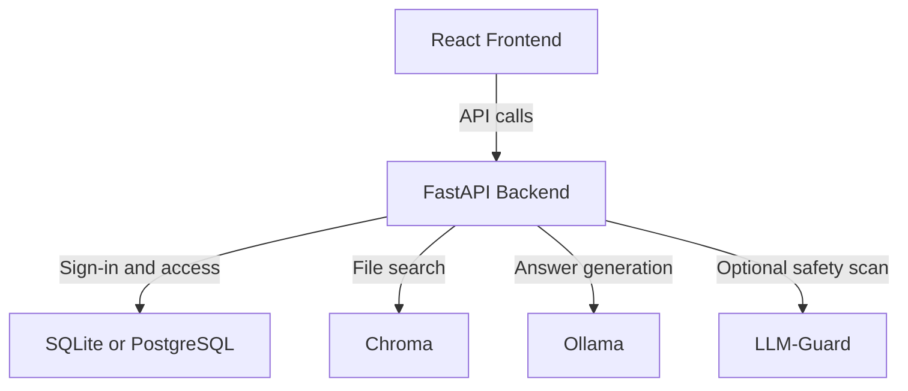

<p align="center">
  
</p>

<h1 align="center">Drifting-Apollo</h1>
<p align="center">Private local AI workspace for chat, files, and access-controlled collaboration.</p>

<p align="center">
  <a href="https://opensource.org/licenses/MIT">
    
  </a>
  
  
  
</p>

<p align="center">
  
  
  
  
</p>

<p align="center">
  
</p>

## Overview

Drifting-Apollo is a private workspace for chatting with a local AI model and your uploaded files. It is built for teams or individuals who want local-first AI workflows, sign-in, saved chat, and file-backed answers in one app.

## Tech Stack

- Frontend: React, Vite, Tailwind CSS
- Backend: FastAPI, Python
- Database: SQLite by default, PostgreSQL through `DATABASE_URL`
- AI services: Ollama for generation, Chroma for file search
- Optional safety service: LLM-Guard sidecar
- Packaging and local infra: Docker Compose

## What It Does

- Sign-in with two access levels: `admin` and `user`
- First admin setup from the same machine by default
- Saved chat history per signed-in person
- PDF and TXT uploads with file-backed answers
- Admin-only people management
- Health and service status in the UI
- Optional safety scanning for prompts, files, retrieved context, and model output

## Safety and Access

- Frontend access is limited to local development origins such as `http://localhost:5173`
- Backend listens on `127.0.0.1` by default
- Login and first-admin setup are rate-limited
- Uploaded files are capped at 10 MB
- Auth signing data is generated automatically when not provided
- Docker services are bound to `127.0.0.1` by default
- Optional LLM-Guard scanning can be enabled for stricter deployments

## Architecture



## Quick Start

### 1. Prerequisites

- [Docker & Docker Compose](https://docs.docker.com/get-docker/)
- [Node.js](https://nodejs.org/)
- [Python 3.10+](https://www.python.org/)

### 2. Start Local Services

```bash
docker compose up -d
```

To include the optional safety sidecar, configure its local auth setting in your shell and start the `security` profile.

```bash
docker compose --profile security up -d
```

### 3. Start the Backend

```bash
cd backend
python3 -m venv .venv
source .venv/bin/activate
pip install -r requirements.txt
python main.py
```

If you want to customize database, model, host, or safety-service behavior, add a local `.env` file before starting the backend.

### 4. Start the Frontend

```bash
cd frontend
npm install
npm run dev
```

Open the app at `http://localhost:5173`.

## Access Model

- Not signed in: health checks and first admin setup only
- User: chat, view files, and manage personal chat history
- Admin: everything a user can do, plus upload files and manage people

## LLM-Guard Sidecar

LLM-Guard runs as a separate API service in this project. When enabled, it can scan:

- user prompts
- uploaded file text
- retrieved file context
- model output

The included [scanners.yml](/Users/minhtet/Projects/drifting-apollo/llm-guard/scanners.yml) focuses on prompt injection, hidden text, input size checks, sensitive content checks, and unsafe links.

## Roadmap

- More detailed access rules beyond `admin` and `user`
- Named conversations and history search
- More advanced file management
- Stricter LLM-Guard tuning for production use

## License

Licensed under the [MIT License](https://opensource.org/licenses/MIT).
